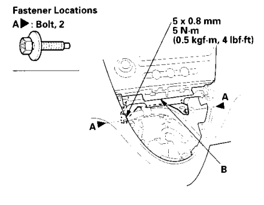
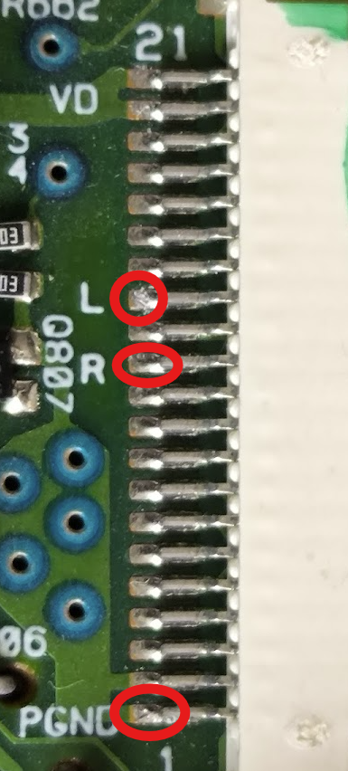
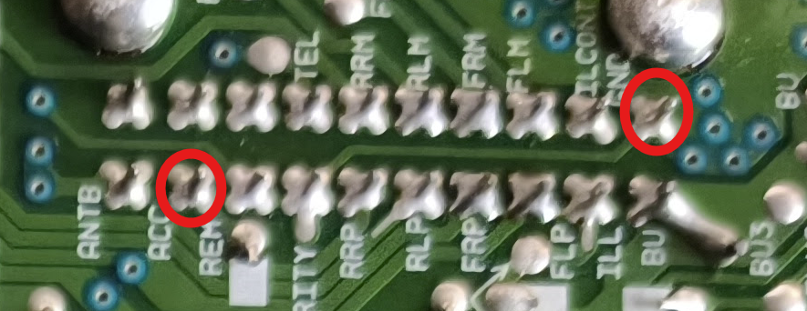
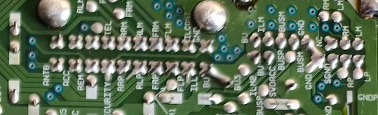
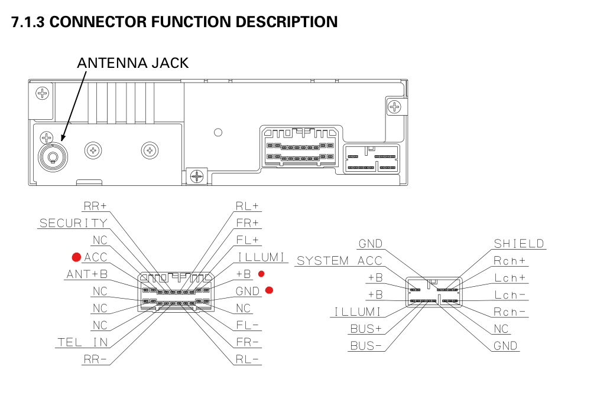
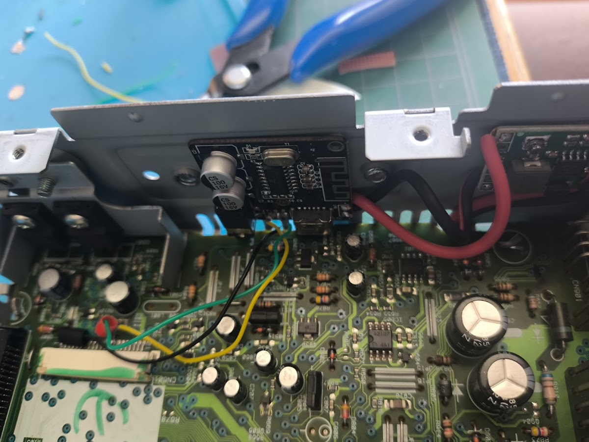
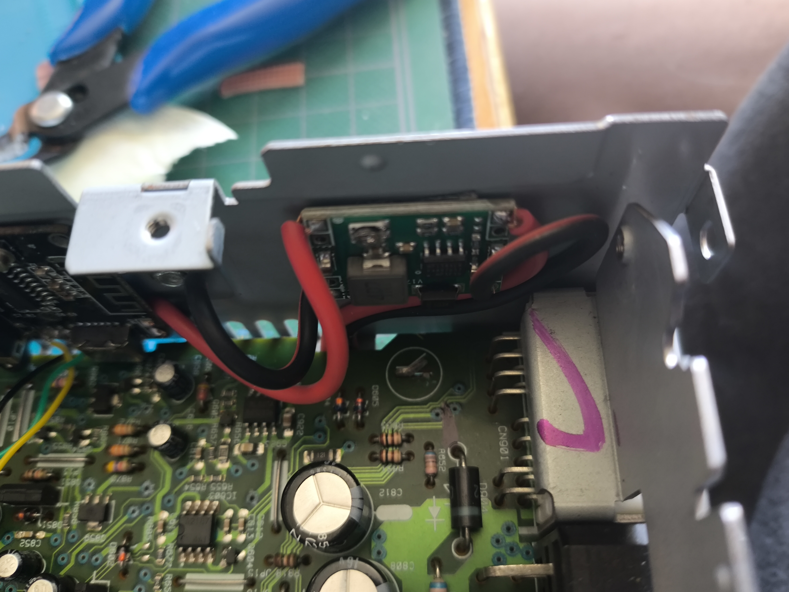

# 04 Honda Civic (Pionneer DEH-M6006ZH) Bluetooth Mod 

Documented here are the steps, resources and components that I used in order to get Bluetooth support on my 2004 Honda Civic (Hatchback) :)

The radio's model is **Pioneer DEH-M6006ZH**.

## Disclaimer

I'm just a hobyist that likes to tinker with electronics, but I haven't much knowledge in this domain, so try the steps layed out here at your own risk!

## Pre-requesites

- Security Codes

Only remove the radio from the car if you've got the security codes for it!

From my research online, there are ways to figure it out, but I didn't delve into it, as I had mine, so I don't know the extent of this workaround.

- Soldering Skills & Tools

Some of the pins that you'll need to solder are extremely precise. If this is your first soldering project, take that into consideration! Although it's not impossible and I believe that a beginner can succeed, it is recommended to have some familiarity with your soldering iron and solder.

- Wrench + Socket + Extension 

In order to remove your head unit from the dashboard, you'll need a ratcheting wrench with an extension, as the fasteners will be a bit out of reach without them.

The only socket size you'll need is **8mm**.

You can see here for the location of the two fasteners.

- CD

Yes... You're going to need a CD (there's probably some way that you wouldn't need one, but I didn't research into it). This is because we're hijacking the L/R channels from the CD connector, to inject the data that's coming from the Bluetooth module.

Also, if you don't want some background music, burn a blank CD with some silent sound file.

- Bluetooth Module

I just bought some cheap ones from [Aliexpress](https://www.aliexpress.com/item/1005006812039173.html).

Do note that some come with the *"Bluetooth connected"* voice and if that bothers you, check the reviews or buy in low quantities.

The one I bought ended coming with it, but it isn't that much of a nuisance (no particular accent).

- Voltage Regulator

A low profile one works best. Just like the Bluetooth module, I got one from [Aliexpress](https://www.aliexpress.com/item/1005005870392716.html).

There are some that you can solder the output voltage directly, meaning you don't have to fiddle with the sensitive "screw" ( I don't know the actual name :) ).

- Wires
- Method to mount modules. I used double sided tape, which can withstand high temperatures

## Wiring

The wiring is actually pretty simple!

L/R and PGND (GND) are all found on the CD connector pins.

Power for the Bluetooth module is obtained by means of the regulator which itself obtains it from the **ACC** power pin, in the bottom of the PCB. We want to use ACC power because that's only on when the key is in that ACC position. This means that it isn't always on, as it would be with constant power.

## Testing

If you've got a bench power supply, you can power this radio on.

What you'll need to do is connect the power to the accessory power pin (ACC), constant power pin and lastly to ground. My radio had the pins labeled on the bottom of the PCB, which you can then follow to the exterior pins, but the [radio manual](./docs/pioneer_deh-m6006zh-m6017zh.pdf) also has them on page 60.

<small>*(sorry for the blurriness)*</small>

Besides power, you should be able to connect some speakers to it so that you can test sound output as well. I did not do this myself, as I didn't have any spare speakers for this, testing only if the Bluetooth module powered on and subsequently testing it in the car.

## Results

In the end, this is what I ended up with

This was the only place I could find where the modules wouldn't interfere with anything and could still remain inside the radio unit itself.

After connecting everything with your car, you should just need to insert the silent CD, which changes to CD output automatically, and connect with the module and presto!

If you've got any questions, reach out and I'll do my best to answer them :)

## Resources

I recommend this [disassembly video](https://youtu.be/my2C_ke52Ik?si=G4k25ujVkRHawrf6) if you don't have the service manual for this car.

Although it doesn't relate directly to this radio unit, I found this [video](https://youtu.be/3jQEe7RlPbg?si=raPDOkYc7PmguZ8j) to be extremely informative and helpful in figuring out what I needed to perform this mod.

You can also find in the docs folder the [radio's manual](./docs/pioneer_deh-m6006zh-m6017zh.pdf) with detailed schematics (some didn't match accurately with my model, but it shouldn't differ that much).

## Side Notes

Although I didn't probe around, as when I got it powered on, I had the modules glued already, I found some possible 5V sources in the schematics, which can be found in the [radio's manual](./docs/pioneer_deh-m6006zh-m6017zh.pdf). I **assume** this **could** eliminate the need for a voltage regulator (which does 12V -> 5V).
